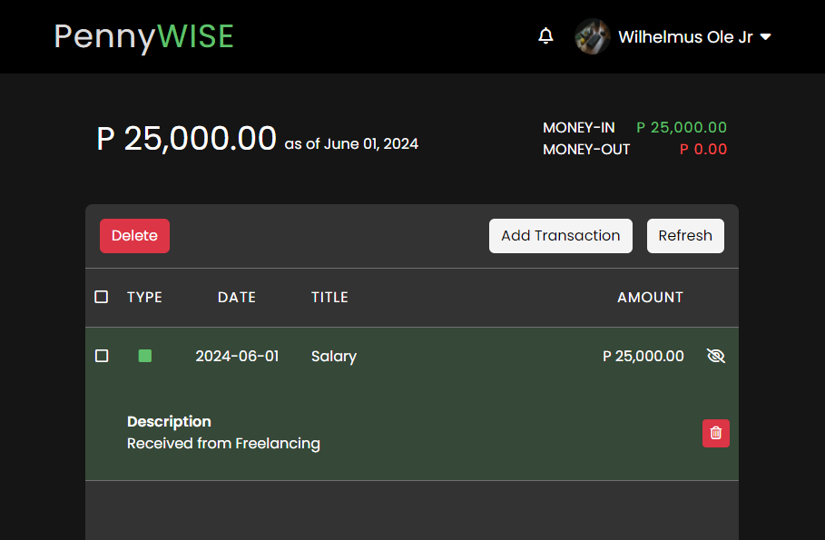
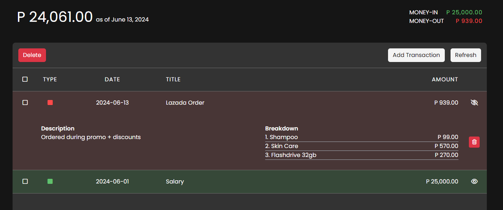

# PennyWISE PH
PennyWISE is a user-friendly mobile money tracker designed to help individuals manage their finances effectively.

  

 

PennyWISE app is a comprehensive money tracker designed to help users manage their financial transactions effectively. It enables users to monitor their money inflow and outflow seamlessly, providing a clear computation of their financial activities. With PennyWISE, users can input detailed information for each transaction, including the transaction name, description, amount, and date. This application simplifies personal finance management by offering an intuitive interface for tracking and analyzing money transactions, empowering users to make informed financial decisions and maintain control over their finances.

PennyWISE features an integrated account system, allowing users to access their financial data securely over the internet from anywhere and at any time. This ensures that users can manage their finances conveniently, whether they are at home, at work, or on the go. With real-time updates and synchronization across devices, PennyWISE provides a reliable platform for users to stay organized and informed about their financial health.

## Features
* Transaction Tracking: Easily track and manage your money transactions, recording both income and expenses for a complete financial overview.
* Detailed Entry Fields: Input detailed information for each transaction, such as the transaction name, description, amount, and date, ensuring accurate and organized records.
* Inflow and Outflow Management: Monitor your financial inflows and outflows with ease, helping you understand and manage your cash flow effectively.
* Real-Time Computation: Instantly calculate the total balance based on recorded transactions, providing a clear picture of your financial status at any given time.
* Cross-Device Access: Access your financial data securely over the internet from anywhere and at any time, ensuring seamless management of your finances across devices.
* User-Friendly Interface: Designed with simplicity in mind, the app ensures an intuitive and straightforward user experience, making financial management accessible to everyone.

## Have a visit

Please click <a target="blank" href="#">here</a> or manually visit bit.ly/ph-identifier.

## Technology Used
This section provides an overview of the key technologies and frameworks utilized in the development of the Philippine Currency Identifier app:

* Programming Languages: PHP, Javascript
* Integrated Development Environments: Visual Studio.
* Design and Prototyping Tool: Adobe XD and Photoshop.
* Other technologies: Bootstrap, Laravel, Font Awesome

## Support or Contact
If you encounter any issues or have questions about the this app, please don't hesitate to reach out to me directly at wilhelmus.olejr@gmail.com. As the sole developer, I am dedicated to offering support and will do my best to respond to your queries and concerns promptly, aiming to provide solutions and enhance your app experience.

## Contributing
I welcome contributions of all kinds from the community. If you're interested in helping improve this app, please:
* Fork the repository and create your branch from `main`.
* Write clear code and add appropriate tests.
* Submit a pull request with comprehensive descriptions of changes.

## Screenshot

  

  

